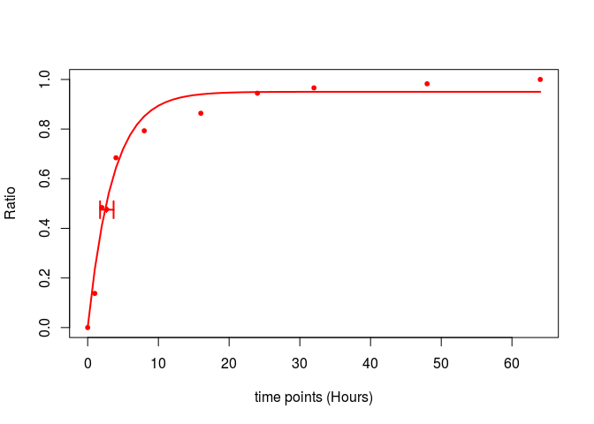
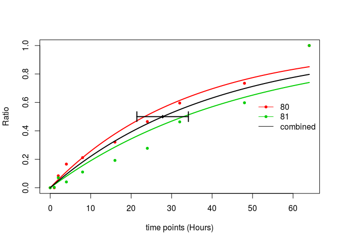
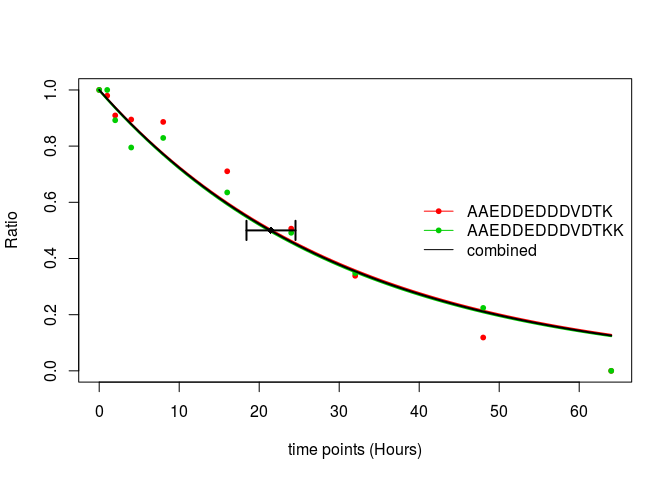

## Abstract

Pulse-SILAC has been used to analyze protein turnover in a system-wise. This package 
provides convenient functions to fit protein degradation and synthesis curves
using pulsed SILAC data. In addition, a graphical user interface is provided.

## Introduction

Pulsed (or time resolved) SILAC experiments have been successfully applied to
proteome-wise study of protein turnover rate [1].  
In a simple experimental setup,
initially all proteins in a cell population are completely (heavy) labeled, then 
the culture medium is changed from heavy to light (unlabeled) so the newly synthesis 
proteins would contain only the light (unlabeled) amino acids. After a long time of 
culturing, all the proteins in the population would become light labelled. In order to quantify 
protein degradation rate, the amount of heavy labelled proteins at different time points 
are compared with heavy labelled proteins at time point 0 (before changing medium). 
As a result, the proportion of un-degraded proteins is available at different time points, which
could be used to fit models to calculate protein degradation constant and other parameters. 
This package provides functions fitting protein turnover curves using nonlinear least square (NLS) 
methods. For the degradation curve, the following model is fitted:

$$ f(t) = (A-B) \cdot e^{-(k_d + \frac{ln2}{t_{cc}}) \cdot t} + B$$

The synthesis curve, the fitted model is:

$$ f(t) = (B-A) \cdot e^{-(k_s + \frac{ln2}{t_{cc}}) \cdot t} + A $$

where $$k_d$$ and $$k_s$$ are the degradation and synthesis constant respectively, which are going to be estimated. The $$t$$ is the time points given in hours and $$t_{cc}$$ is the cell doubling time. With the assumption of steady state (no proliferation), this parameter is set to infinite (`Inf`). In addition, two other parameters are included: $$A$$ is the (normalized) amplitude, $$B$$ accounting for the offset seen in data, which could be attributed by the recycling of amino acids in protein synthesis.

## Data preparation
The data is assumed to be properly normalized and transform to the ratios, that is, at a specific time point, the proportion of newly synthesized protein (for synthesis curve fitting) or remained protein (for degradation curve fitting). 
The package is primarily designed for the pSILAC data, but it can also be used to any data transformed to this format. 

## Workflow
### Installation

You can install the pacakge by:


library(devtools)
install_github("mengchen18/proturn")


### Loading data
Then, load the library and read example data:


library("proturn")



## Loading required package: shinyBS



## Loading required package: parallel



dat <- read.delim(system.file("example.data.txt", package = "proturn"))
# rows are peptides
colnames(dat)



##  [1] "Sequence"          "Gene.names"        "Leading.proteins" 
##  [4] "Proteins"          "deg.Modifications" "deg.Intensity"    
##  [7] "deg.id"            "syn.Modifications" "syn.Intensity"    
## [10] "syn.id"            "Ratio.0.deg"       "Ratio.1.deg"      
## [13] "Ratio.2.deg"       "Ratio.3.deg"       "Ratio.4.deg"      
## [16] "Ratio.5.deg"       "Ratio.6.deg"       "Ratio.7.deg"      
## [19] "Ratio.8.deg"       "Ratio.9.deg"       "Ratio.0.syn"      
## [22] "Ratio.1.syn"       "Ratio.2.syn"       "Ratio.3.syn"      
## [25] "Ratio.4.syn"       "Ratio.5.syn"       "Ratio.6.syn"      
## [28] "Ratio.7.syn"       "Ratio.8.syn"       "Ratio.9.syn"

`dat` is a *data.frame* has 100 rows, each represent a peptides. Columns 1 to 10 are annotation information for peptides, including sequence, gene name, intensity measured in mass spectrometry, etc. The subsequent columns are the ratio of remaining peptide from degradation and the ratio of newly synthesis peptides, indicated by "deg" and "syn" in the end of column headers. The degradation and synthesis ratios are measured at the same time points from 0 hours to 64 hours. 

### Fitting a single degradation/synthesis curve
The package provides a easy ways to fit a single degradation or synthesis curve and to visualized the fitted curve. The following codes show how to fit a synthesis curve for the peptide in the first row of `dat`:


# fit a signle synthesis curve for the peptide on the first row
# define time points
timepoints <- c(0, 1, 2, 4, 8, 16, 24, 32, 48, 64)
# get ratios of newly synthesized peptides
rat <- unlist(dat[1, grep("syn$", colnames(dat))])
# fit synthesis curve, assume cell is in a stady state, i.e. no proliferation. 
fit <- fitSynNLS(x=rat, t = timepoints, tcc = Inf)



## Waiting for profiling to be done...



# plot ratios and fitted curve
plotCurve.one(x = fit, t = timepoints, tcc = Inf)


The horizontal error bar indicates the 95% confidence internal of peptide's half-life. 

### Fitting a protein degradation/synthesis curve using multiple peptides
In a pSILAC experiment, we always identify multiple peptides from the same protein, would they have the same degradation/synthesis rate? If so, we should be able to have a narrower confidence interval of $k_d$/$k_s$ if we combine them to fit a single model. In this case, we can use a matrix, where each row represents a single peptide from the protein, as input to fit a model. In our exemplary data, there are some peptides from the same proteins, we will use one of them as an example to know how to fit a single model using multiple peptides. 


# find proteins that have more than two peptides in the data
plist <- sort(table(dat$Proteins), decreasing = TRUE)[1:10]
# select the second protein as an example
i <- dat$Proteins == names(plist)[2]
# getting the synthesis ratios of peptide from this protein
rat2 <- as.matrix(dat[i, grep("syn$", colnames(dat))])
# fit the model
fit2 <- fitSynNLS(x=rat2, t = timepoints, tcc = Inf, fitIndividual = TRUE)



## Waiting for profiling to be done...
## Waiting for profiling to be done...
## Waiting for profiling to be done...



# fit individual = TRUE
plotCurve.comb(x = fit2, t= timepoints)


In this plot, you can see three fitted lines, the black line is the model fitted using both peptides. Where are the other two lines from? Please note that there is an argument `fitIndividual = TRUE`, this means in addition to fit one model using all the data points, also fit models using each individual row in the matrix. So in this plot, the green and red lines are the models fitted from each individual peptides. For this protein, the two individual peptides have fairly similar turnover rate, so probably it is not a bad idea to fit a single model using both. But in [this paper][ref][2], we clearly see that peptides from the same protein do not always have similar turnover rate, why? Right, isoforms. Some times peptides from a specific isoform may have different cycling rate, in these cases, you may find two clusters of curves. That's why we also want to fit curves on peptide level. 

Also note that the only requirement of fitting combined curve is `x` is a matrix, which could be multiple peptides from the same protein (as this example). However, it could also be multiple proteins from the same complex, or the same peptide but multiple identification by mass spectrometry. The function is general enough to fit combined models on all level.

### Fitting curves for all peptides/proteins in an experiment
Mass spectrometry base pSILAC measures proteins turnover from a system-wise, according, this package provides a convenient function to fit curves for all peptide/proteins in an experiment. Here, we will fit the degradation curves for all peptides (and proteins) in the example data:


# matrix for degradation ratios
degRat <- as.matrix(dat[ , grep("deg$", colnames(dat))])
rownames(degRat) <- as.character(dat$Sequence)
# fitting model
fits <- fitNLSModels(x = degRat, f = dat$Proteins, t = timepoints, type = "deg", tcc = Inf)
# plot one protein
plotCurve.comb(x = fits$list$`P06454-2;P06454`, t= timepoints)


In the `fitNLSModels` function, `f` is the collapse factor specifying which rows should be combined to fit a single model. In this example, each individual row is a peptide and we want to fit the combined models on protein levels, so `f` is a factor (or a *character* vector) indicating to which protein of each peptides belongs. 

In addition to the list of fitted models stored in `fits$list`, the fitted parameters are also available in a matrix format:


params <- fits$mat
head(params)



##                                               collapsed.factor         A
## AAAAAAAAVPSAGPAGPAPTSAAGR                               Q9Y4H2 1.0000000
## AAAAAAALQAK                                             P36578 0.9950812
## AAAAAATAPPSPGPAQPGPR                                    Q6SPF0 0.9646336
## AAAAALSQQQSLQER                                Q8WUQ7;Q8WUQ7-2 0.9971661
## AAAAATVVPPMVGGPPFVGPVGFGPGDR Q9BTD8-4;Q9BTD8-2;Q9BTD8-3;Q9BTD8 1.0000000
## AAAAAWEEPSSGNGTAR                                       Q9P258 0.9973969
##                                       B         kd      ci025      ci975
## AAAAAAAAVPSAGPAGPAPTSAAGR    0.04964960 0.28308786 0.18925477 0.39553827
## AAAAAAALQAK                  0.00000000 0.02287097 0.01500534 0.04311528
## AAAAAATAPPSPGPAQPGPR         0.01211067 0.07417499 0.06247442 0.09262566
## AAAAALSQQQSLQER              0.00000000 0.03686848 0.03124309 0.04627656
## AAAAATVVPPMVGGPPFVGPVGFGPGDR 0.00000000 0.09966324 0.06568881 0.16489857
## AAAAAWEEPSSGNGTAR            0.00000000 0.03790642 0.03249775 0.04569551
##                                       mse       rsq    comb.A     comb.B
## AAAAAAAAVPSAGPAGPAPTSAAGR    0.0029322409 0.9753521 1.0000000 0.04964960
## AAAAAAALQAK                  0.0072510662 0.9150443 0.9950812 0.00000000
## AAAAAATAPPSPGPAQPGPR         0.0007126207 0.9943979 0.9646336 0.01211067
## AAAAALSQQQSLQER              0.0014517148 0.9870468 0.9971661 0.00000000
## AAAAATVVPPMVGGPPFVGPVGFGPGDR 0.0100974228 0.9455847 1.0000000 0.00000000
## AAAAAWEEPSSGNGTAR            0.0012770194 0.9889952 0.9973969 0.00000000
##                                 comb.kd comb.ci025 comb.ci975     comb.mse
## AAAAAAAAVPSAGPAGPAPTSAAGR    0.28308786 0.18925477 0.39553827 0.0029322409
## AAAAAAALQAK                  0.02287097 0.01500534 0.04311528 0.0072510662
## AAAAAATAPPSPGPAQPGPR         0.07417499 0.06247442 0.09262566 0.0007126207
## AAAAALSQQQSLQER              0.03686848 0.03124309 0.04627656 0.0014517148
## AAAAATVVPPMVGGPPFVGPVGFGPGDR 0.09966324 0.06568881 0.16489857 0.0100974228
## AAAAAWEEPSSGNGTAR            0.03790642 0.03249775 0.04569551 0.0012770194
##                               comb.rsq
## AAAAAAAAVPSAGPAGPAPTSAAGR    0.9753521
## AAAAAAALQAK                  0.9150443
## AAAAAATAPPSPGPAQPGPR         0.9943979
## AAAAALSQQQSLQER              0.9870468
## AAAAATVVPPMVGGPPFVGPVGFGPGDR 0.9455847
## AAAAAWEEPSSGNGTAR            0.9889952

where the columns with a header starting with "comb" are the model parameters for the combined fittings, the rest are for individual fittings.

## Shiny application
The package also include a shiny application, to start the app:


library(proturn)
runShiny()

Two arguments could be specified:

* *maxFileSize* The maximum file size that is allowed to be uploaded to the app. The default is *100\*1024^2* corresponding to ~100MB, adjust it according to your own needs. 

* *figureFolder* If you want to visually check all the curves, it's more convenient to save them on your disk. This 
argument gives a control on where you want to save all the figures. 

An instruction about how to use the shiny app could be find [here][shinyintro].

## Session info
Here is the output of `sessionInfo()` on the system on which this
document was compiled:


## R version 3.4.1 (2017-06-30)
## Platform: x86_64-pc-linux-gnu (64-bit)
## Running under: Ubuntu 16.04.2 LTS
## 
## Matrix products: default
## BLAS: /usr/lib/libblas/libblas.so.3.6.0
## LAPACK: /usr/lib/lapack/liblapack.so.3.6.0
## 
## locale:
##  [1] LC_CTYPE=en_US.UTF-8       LC_NUMERIC=C              
##  [3] LC_TIME=de_DE.UTF-8        LC_COLLATE=en_US.UTF-8    
##  [5] LC_MONETARY=de_DE.UTF-8    LC_MESSAGES=en_US.UTF-8   
##  [7] LC_PAPER=de_DE.UTF-8       LC_NAME=C                 
##  [9] LC_ADDRESS=C               LC_TELEPHONE=C            
## [11] LC_MEASUREMENT=de_DE.UTF-8 LC_IDENTIFICATION=C       
## 
## attached base packages:
## [1] parallel  stats     graphics  grDevices utils     datasets  base     
## 
## other attached packages:
## [1] proturn_0.99.0 shinyBS_0.61  
## 
## loaded via a namespace (and not attached):
##  [1] Rcpp_0.12.13       matrixStats_0.52.2 digest_0.6.14     
##  [4] MASS_7.3-47        mime_0.5           R6_2.2.2          
##  [7] xtable_1.8-2       magrittr_1.5       evaluate_0.10.1   
## [10] highr_0.6          blogdown_0.4.6     stringi_1.1.6     
## [13] tools_3.4.1        stringr_1.2.0      shiny_1.0.5       
## [16] httpuv_1.3.5       xfun_0.1           yaml_2.1.16       
## [19] compiler_3.4.1     htmltools_0.3.6    knitr_1.18        
## [22] methods_3.4.1


## References
[1] François-Michel Boisvert, Yasmeen Ahmad, Marek Gierliński, Fabien Charrière, Douglas Lamont, Michelle Scott§, Geoff Barton and Angus I. Lamond. 2012. "A Quantitative Spatial Proteomics Analysis of Proteome Turnover in Human Cells." Molecular & Cellular Proteomics: MCP 11 (3): M111.011429.
[2] Jana Zecha, Chen Meng, Daniel Paul Zolg, Patroklos Samaras, Mathias Wilhelm and Bernhard Kuster. 2018. "Peptide level turnover measurements enable the study of proteoform dynamics." Molecular & Cellular Proteomics: MCP

[ref]: http://m.mcponline.org/content/early/2018/02/02/mcp.RA118.000583

[shinyintro]: https://mengchen18.github.io/2018/01/30/proturn-shiny.html
